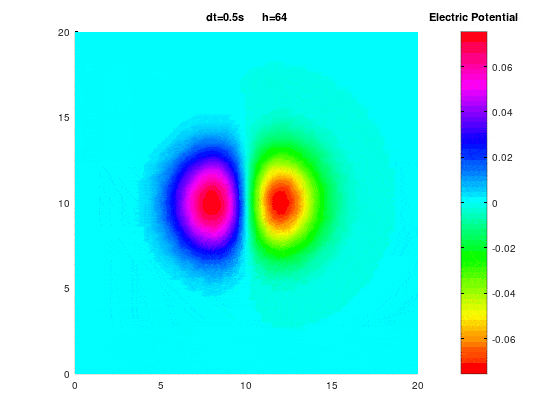
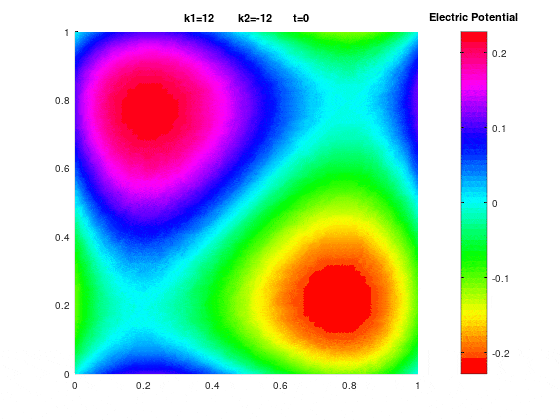

# Hasegawa-Mima Equation Simulator

[Hasegawa-Mima](https://en.wikipedia.org/wiki/Hasegawa%E2%80%93Mima_equation) equation simulator based on the [FreeFem++](https://freefem.org/) finite element software. Written by [Sophie Moufawwad](https://www.researchgate.net/profile/Sophie_Moufawad2) and maintained by [Adel Saleh](https://github.com/adelsaleh).

<div align="center" style="width:85%; height:auto;">
  
</div>

---

## The Hasegawa-Mima Equation


In their 1977 paper *[Pseudo‐three‐dimensional turbulence in magnetized nonuniform plasma](https://aip.scitation.org/doi/10.1063/1.862083),* Hasegawa and Mima derived a 3rd order non-linear differential equation to model the edge of a magnetically confined plasma in a Tokamak reactor. 

<p align="center">
  
</p>

The curly braces in the above equation denote the *[Poisson braket](https://en.wikipedia.org/wiki/Poisson_bracket)* which is the source of the non-linearity in the equation. The equation is solved on the Torus, which is identified with a 2d square with periodic boundary values. 

The numerical scheme used here is a finite element in space semi-implicit in time, and is derived in the following paper [[1]](#1). 

--- 

## The Simulation

The simulation is done using the FreeFem++ ( FF++ for shorthand), a high level language for solving and simulating the weak form of PDEs using the finite element Galerkin method. Listed below are some useful links for learning FF++.  
 -  [Documenation](https://doc.freefem.org/pdf/FreeFEM-documentation.pdf)  
 -  [Examples](https://doc.freefem.org/examples/index.html) 
 -  [Community](https://community.freefem.org/c/general-discussion/7)
 
The main simulation file which contains most inital data is the ```hm.edp``` file. To run the simulation, just type:

```
FreeFem++ hm.edp 
```

The simulation should be similar to the first figure above. This corresponds to the default [initial data](#initial-data) given to the simulation. The following optional arguments can be passed to the simulation.  

| Parameter | Description | 
| ----------- | ----------- |
| -mesh | Number of nodes on the sides of simulation box |
|       | 32.0 (default) \| Any real number | 
| -dt | Time step  |  
|  | 0.1 (default) \| Any number less than  1/mesh  |  
| -endt | End time for simulation | 
|  | 64.0 (default) \| Any real number | 
| -test | Number between 1 and 5 indicating the choice of initial data | 
|  | See details in the initial data section [below](####initial-data)  | 
| -out | Choose whether to output data for in .txt format |
|  | 1 to turn on \| 0 to turn off (default) |
| -d | Dimension of the plot   |
| | 2 for 2d isovalues plot (default) \| 3 for 3d surface plot |
| -plt | Turn plotting on or off   |
| | 1 for plotting (default) \| 0 to disable plotting |
| -x0 | Smallest x coordinate in the simulation box   |
|  | 1.0 (default) \| any real number |
| -x1 | Largest x coordinate in the simulation box   |
|  | 1.0 (default) \| any real number |
| -y0 | Smallest y coordinate in the simulation box   |
|  | 1.0 (default) \| any real number |
| -y1 | Largest y coordinate in the simulation box   |
|  | 1.0 (default) \| any real number |

#### Initial Data 

- Test 1: Traveling wave in the *y* direction <p align="center"></p>

- Test 2: Traveling wave in the *x* direction. 
<p align="center">
  
</p>

- Test 3: The domain used for this test is the square with ```x0=y0=0``` and ```x1=y1=L```, and the initial data is  
<p align="center">
  
</p>


## Traveling Waves

<div align="center" style="width:85%; height:auto;">
  
</div>

Part of the goals of this simulation is to be able to replicate known results in the literature regarding stationary taveling waves of the HM equation. Refer to third chapter of the following MS thesis [[2]](#2) for a discussion of the problem.  It turns out that the initial data for which the corresponding solution is a stationary wave are in fact solutions to a semi-linear elliptic equation on the square. More precisely, 
the initial data solves the equation

<p align="center">
 
</p>

The code for the traveling waves simulation can be found in the ```modon.edp``` file. To run the simulation, type the following code. 

``` 
FreeFem++ modon.edp 
```

The parameters given are the same as for ```hm.edp``` but with extra choices for the particle density function. 


| Parameter | Description | 
| ----------- | ----------- |
| -k1 | Particle density's x component |
| | 12 (default) \| any real number |
| -k2 | Particle density's y component |
| | 12 (default) \| any real number |


## References
<a id="1"><b>[1]</b></a> 
H. Karakazian, S. Moufawad, and N. Nassif, "A finite-element model for the hasegawa-
mima wave equation", 2021. doi: 10.48550/ARXIV.2101.09531. [Online]. Available: [https://arxiv.org/abs/2101.09531](https://arxiv.org/abs/2101.09531)

<a id="2"><b>[2]</b></a> 
A. Saleh, "Analysis and Implementation for an Time Euler Implicit - Space Finite Element Approximation To a Hasegawa-Mima Plasma Model", M.S thesis, Dept. of Mathematics, American Univ. of Beirut, Beirut, 2022. 


